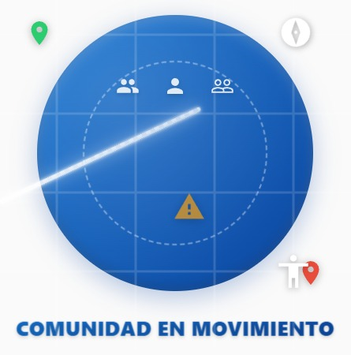

# 🌆 Comunidad en Movimiento

<p align="center">
  
</p>

<p align="center">
  <strong>Aplicación de navegación urbana accesible impulsada por IA</strong>
</p>

<p align="center">
  <a href="#características">Características</a> •
  <a href="#tecnologías">Tecnologías</a> •
  <a href="#instalación">Instalación</a> •
  <a href="#uso">Uso</a> •
  <a href="#arquitectura">Arquitectura</a> •
  <a href="#contribuir">Contribuir</a>
</p>

---

## 📱 Descripción

**Comunidad en Movimiento** es una aplicación móvil desarrollada en Flutter que revoluciona la navegación urbana para personas con movilidad reducida o discapacidades. Utilizando inteligencia artificial y el poder de la comunidad, la app identifica y evita barreras arquitectónicas, predice posibles incidencias en las rutas y ofrece alternativas accesibles.

## ✨ Características

### 🗺️ Navegación Inteligente
- **Rutas accesibles**: Calcula rutas evitando escaleras, obras y barreras arquitectónicas
- **Modo silla de ruedas**: Integración con OpenRouteService para rutas wheelchair-friendly
- **Predicción de incidencias**: IA que predice la probabilidad de encontrar obstáculos en tu ruta
- **Vista 3D de peligros**: Visualización innovadora de tramos peligrosos en pseudo-3D

### 🤖 Inteligencia Artificial
- **Modelo TensorFlow Lite**: Red neuronal entrenada para predecir incidencias basándose en:
  - Ubicación geográfica
  - Día de la semana y mes
  - Densidad de incidencias históricas
  - Proximidad a puntos de interés
- **Análisis en tiempo real**: Evaluación de rutas con hasta 20 sub-segmentos analizados
- **Aprendizaje continuo**: El modelo mejora con los datos de la comunidad

### 👥 Comunidad Colaborativa
- **Reporte de incidencias**: Los usuarios pueden marcar nuevos obstáculos
- **Categorización inteligente**:
  - Escaleras sin rampa
  - Obras en la vía
  - Vehículos mal estacionados
  - Aceras estrechas
  - Semáforos sin avisos sonoros
  - Y más de 10 categorías
- **Validación comunitaria**: Sistema de verificación de incidencias reportadas

### 🌐 Accesibilidad Universal
- **Soporte multiidioma**: Español, Inglés, Francés y Alemán
- **Modos de daltonismo**: 
  - Protanopia
  - Deuteranopia
  - Tritanopia
- **Síntesis de voz**: Lectura de instrucciones y alertas
- **Interfaz adaptativa**: Diseñada siguiendo principios de diseño universal

### 🔧 Características Adicionales
- **Clima en tiempo real**: Widget meteorológico integrado
- **Chatbot asistente**: Powered by GPT para ayuda contextual
- **Street View integrado**: Visualización de ubicaciones antes de visitarlas
- **Modo offline parcial**: Caché de rutas y datos esenciales
- **Notificaciones push**: Alertas sobre nuevas incidencias en tu zona

## 🛠️ Tecnologías

### Frontend
- **Flutter 3.5.4+**: Framework multiplataforma
- **Dart**: Lenguaje de programación
- **Material Design 3**: Sistema de diseño

### Backend & Servicios
- **Firebase**:
  - Authentication: Gestión de usuarios
  - Cloud Firestore: Base de datos NoSQL
  - Cloud Messaging: Notificaciones push
- **APIs Externas**:
  - OpenRouteService: Cálculo de rutas
  - OpenStreetMap: Mapas base
  - Overpass API: Datos de infraestructura urbana
  - OpenWeatherMap: Información meteorológica

### Machine Learning
- **TensorFlow Lite**: Inferencia en dispositivo
- **Python**: Pipeline de entrenamiento
- **Scikit-learn**: Preprocesamiento de datos
- **SMOTE**: Balanceo de clases

### Principales Dependencias
```yaml
dependencies:
  flutter_map: ^7.0.2          # Mapas interactivos
  geolocator: ^13.0.2          # Geolocalización
  firebase_core: ^3.8.1        # Firebase
  tflite_flutter: ^0.11.0      # IA en dispositivo
  flutter_tts: ^4.2.0          # Text-to-speech
  latlong2: ^0.9.1             # Coordenadas
  http: ^1.2.2                 # Peticiones HTTP
```

## 📲 Instalación

### Prerrequisitos
- Flutter SDK 3.5.4 o superior
- Dart SDK
- Android Studio / Xcode
- Cuenta de Firebase
- API Keys para servicios externos

### Pasos de instalación

1. **Clonar el repositorio**
```bash
git clone https://github.com/DidiSDev/comunidad_en_movimiento.git
cd comunidad_en_movimiento
```

2. **Configurar variables de entorno**
Crear archivo `.env` en la raíz:
```env
OPEN_ROUTE_SERVICE_TOKEN=tu_token_aqui
OPENWEATHER_API_KEY=tu_api_key_aqui
GOOGLE_MAPS_API_KEY=tu_api_key_aqui
```

3. **Instalar dependencias**
```bash
flutter pub get
```

4. **Configurar Firebase**
- Crear proyecto en Firebase Console
- Descargar `google-services.json` (Android) y `GoogleService-Info.plist` (iOS)
- Colocar en las carpetas correspondientes

5. **Entrenar el modelo de IA** (opcional)
```bash
cd ml_pipeline

# Crear entorno virtual
python -m venv venv
venv\Scripts\activate  # Windows
# source venv/bin/activate  # Linux/Mac

# Instalar dependencias
pip install -r requirements.txt

# 1. Generar el mapeo de zonas
python generar_zona_mapping.py

# 2. Generar la densidad de zonas
python generar_zona_density.py

# 3. Generar el CSV con los datos de incidencias
python generar_csv_incidencias.py

# 4. Entrenar el modelo
python entrenar_modelo.py
```

6. **Ejecutar la aplicación**
```bash
flutter run
```

## 🚀 Uso

### Primeros pasos
1. **Registro/Login**: Crea una cuenta o inicia sesión
2. **Permisos**: Acepta los permisos de ubicación
3. **Configuración**: Ajusta idioma y modo de daltonismo si es necesario

### Navegación básica
1. Pulsa "Abrir Mapa" en la pantalla principal
2. Selecciona tu destino tocando el mapa o buscando
3. Elige entre:
   - "Iniciar Ruta": Ruta estándar
   - "Evitar escaleras": Ruta accesible

### Reportar incidencias
1. En el mapa, pulsa el icono de menú (⋮)
2. Activa el modo incidencia
3. Toca la ubicación del problema
4. Selecciona el tipo y añade descripción

### Predicción de incidencias
1. Con una ruta calculada, pulsa "Hacer Predicción"
2. Revisa el porcentaje de probabilidad
3. Opcionalmente, visualiza el desglose 3D

## 🏗️ Arquitectura

### Estructura del proyecto
```
comunidad_en_movimiento/
├── lib/
│   ├── main.dart              # Entrada principal
│   ├── auth/                  # Autenticación
│   ├── home/                  # Pantallas principales
│   │   ├── pantalla_principal.dart
│   │   ├── chatbot_widget.dart
│   │   └── clima_widget.dart
│   ├── ia/                    # Inteligencia Artificial
│   │   ├── modelo_ia.dart
│   │   └── asistente_virtual.dart
│   ├── models/                # Modelos de datos
│   ├── services/              # Servicios
│   └── utils/                 # Utilidades
├── ml_pipeline/               # Pipeline de ML
│   ├── entrenar_modelo.py
│   ├── datos_incidencias.csv
│   └── requirements.txt
├── assets/                    # Recursos
│   ├── zona_mapping.json
│   ├── zona_density.json
│   └── scaler_params.json
└── firebase.json             # Configuración Firebase
```

### Flujo de datos
1. **Usuario** → Solicita ruta
2. **App** → Consulta OpenRouteService
3. **IA** → Analiza segmentos de la ruta
4. **Firebase** → Obtiene incidencias cercanas
5. **App** → Muestra ruta con predicciones
6. **Usuario** → Navega y reporta nuevas incidencias

### Modelo de IA
- **Arquitectura**: Red neuronal con 3 capas ocultas (64-32-16 neuronas)
- **Entrada**: 8 características normalizadas
- **Salida**: Probabilidad de incidencia (0-1)
- **Optimización**: Adam optimizer con early stopping
- **Validación**: 5-fold cross-validation

## 🤝 Contribuir
¡Las contribuciones son bienvenidas! Por favor, sigue estos pasos:
1. Fork el proyecto
2. Crea tu rama de características (`git checkout -b feature/AmazingFeature`)
3. Commit tus cambios (`git commit -m 'Add some AmazingFeature'`)
4. Push a la rama (`git push origin feature/AmazingFeature`)
5. Abre un Pull Request

### Guías de contribución
- Sigue las convenciones de código de Flutter/Dart
- Añade tests para nuevas funcionalidades
- Actualiza la documentación según sea necesario
- Asegúrate de que el linter pasa sin errores

## 📄 Licencia
Este proyecto está bajo la Licencia MIT - ver el archivo [LICENSE](LICENSE) para más detalles.

## 👥 Autor
- **Diego Díaz Senovilla** - *Desarrollo inicial* - [DidiSDev](https://github.com/DidiSDev)

## 🙏 Agradecimientos
- A la comunidad de Flutter por las librerías open source
- OpenStreetMap y colaboradores por los datos geográficos
- Firebase por la infraestructura backend
- A todos los usuarios que reportan incidencias y mejoran la accesibilidad urbana

## 📸 Capturas de Pantalla

### Pantalla Principal
<p align="center">
  

</p>

### Navegación y Mapas
<p align="center">
  


</p>

### Inteligencia Artificial
<p align="center">
  


</p>

### Características Adicionales
<p align="center">
  
  


</p>

---

<p align="center">
  <sub>Desarrollado con ❤️ para hacer las ciudades más accesibles</sub>
</p>
